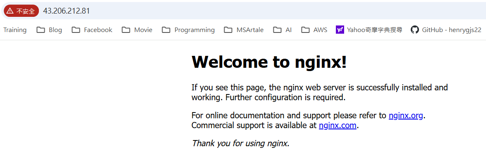

【名詞解釋】

嘗試了解 VPC 最基本元件。
VPC、region、avaliable zones(az), subnet、route table、internet gateway、nat gateway。

   - **VPC (Virtual Private Cloud)**：
     - AWS 中的邏輯隔離虛擬網路環境
     - 類似於傳統資料中心的網路，但存在於雲端
     - 可以完全控制 IP 地址範圍、子網路、路由表和網路閘道
     - 每個 VPC 都屬於一個特定的 region
   
   - **Region（區域）**：
     - AWS 在全球不同地理位置設立的資料中心群組
     - 例如：ap-northeast-1（東京）、us-east-1（維吉尼亞）
     - 每個 region 完全獨立，資源預設不跨 region 共享
     - 選擇 region 時需考慮延遲、法規要求、服務可用性
   
   - **Available Zone (AZ)**：
     - 一個 region 內的一個或多個離散的資料中心
     - 每個 AZ 都有獨立的電源、網路和冷卻系統
     - 用於實現高可用性和容錯
     - 例如：ap-northeast-1a、ap-northeast-1c、ap-northeast-1d
     - ⚠️ 注意：AZ 的 ID（如 1a）在不同帳戶中可能對應不同的實際位置
   
   - **Subnet（子網路）**：
     - VPC 內 IP 地址範圍的區段
     - 必須屬於單一 AZ，不能跨 AZ
     - 可以是 public subnet（可透過 Internet Gateway 存取網際網路）或 private subnet（無法直接存取網際網路）
     - 每個 subnet 必須關聯一個 route table
   
   - **Route Table（路由表）**：
     - 定義子網路中流量如何路由的規則集合
     - 包含目標（destination）和目標（target）的對應關係
     - 預設路由表：VPC 建立時自動建立，包含本地路由（local）
     - 自訂路由表：可為特定 subnet 建立專屬路由表
     - Public subnet 的路由表需包含指向 Internet Gateway 的路由（0.0.0.0/0 → igw-xxx）
     - Private subnet 的路由表通常只包含本地路由，或指向 NAT Gateway（0.0.0.0/0 → nat-xxx）
   
   - **Internet Gateway (IGW)**：
     - 允許 VPC 中的資源與網際網路雙向通訊的閘道
     - 為 VPC 提供公有 IP 地址
     - 一個 VPC 只能附加一個 IGW
     - 必須在路由表中設定路由規則才能使用
     - 免費使用（不收取資料傳輸費用）
   
   - **NAT Gateway**：
     - 允許 private subnet 中的資源存取網際網路（僅出站）
     - 防止網際網路直接存取 private subnet 中的資源
     - 必須建立在 public subnet 中
     - 需要 Elastic IP
     - ⚠️ 注意：按小時和資料傳輸量收費，費用較高，使用完畢需刪除

【實作題】
1. 在東京 region，嘗試創建一個 VPC，其 CIDR 為 10.0.0.0/18，為其創建兩個 subnet 並且其遮罩長度為 20，並且位於不同的 zone，且提供該兩個 subnet 的 CIDR。
   - **步驟**：
     - VPC Console → Create VPC → VPC only
     - Name: `my-vpc`，IPv4 CIDR: `10.0.0.0/18`（提供 16384 個 IP，範圍 10.0.0.0 - 10.0.63.255）
     - Region: ap-northeast-1（東京）
     - 建立兩個 subnet：
       - Subnet 1: Name `public-subnet-1a`，AZ: `ap-northeast-1a`，CIDR: `10.0.0.0/20`（4096 個 IP，範圍 10.0.0.0 - 10.0.15.255）
       - Subnet 2: Name `private-subnet-1c`，AZ: `ap-northeast-1c`，CIDR: `10.0.16.0/20`（4096 個 IP，範圍 10.0.16.0 - 10.0.31.255）
   - **CIDR 計算說明**：
     - VPC CIDR: 10.0.0.0/18 = 10.0.0.0 - 10.0.63.255（前 18 位為網路位址）
     - Subnet /20 表示前 20 位為網路位址，每個 subnet 有 2^(32-20) = 4096 個 IP
     - 第一個 subnet: 10.0.0.0/20（10.0.0.0 - 10.0.15.255）
     - 第二個 subnet: 10.0.16.0/20（10.0.16.0 - 10.0.31.255）
     - 可繼續使用 10.0.32.0/20、10.0.48.0/20 等（不超過 VPC 範圍）

2. 承第一題，為該兩個 subnet 分別創建一個 route table，使其成為 public 跟 private subnet。
   - **建立 Internet Gateway**：
     - VPC Console → Internet Gateways → Create internet gateway → Name: `my-igw`
     - 選擇剛建立的 IGW → Actions → Attach to VPC → 選擇 `my-vpc`
   - **建立 Public Route Table**：
     - VPC Console → Route Tables → Create route table → Name: `public-rt`，VPC: `my-vpc`
     - 編輯路由規則 → Add route：
       - Destination: `0.0.0.0/0`，Target: `my-igw`（Internet Gateway）
     - Subnet associations → Edit subnet associations → 選擇 `public-subnet-1a`
   - **建立 Private Route Table**：
     - VPC Console → Route Tables → Create route table → Name: `private-rt`，VPC: `my-vpc`
     - 路由規則保持預設（只有 local: 10.0.0.0/18 → local）
     - Subnet associations → Edit subnet associations → 選擇 `private-subnet-1c`
   - **關鍵差異**：
     - Public subnet：路由表包含 `0.0.0.0/0 → igw-xxx`，可雙向存取網際網路
     - Private subnet：路由表只有本地路由，無法直接存取網際網路

3. 承第二題，在兩個 subnet 上分別創建一台 ec2，並且使用 ssh 從自己的 laptop 連上此兩台 ec2，提供你的做法。
   - **建立 Key Pair**（如果還沒有）：
     - EC2 Console → Key Pairs → Create key pair → Name: `my-key`，Format: `.pem`（Windows 可用 `.ppk`）
   - **建立 Security Group**：
     - EC2 Console → Security Groups → Create security group
     - Name: `ssh-sg`，VPC: `my-vpc`
     - Inbound rules: 
       - 規則 1：Type: `SSH`，Port: `22`，Source: `My IP`（用於從 laptop 連到 Public EC2）
       - 規則 2：Type: `SSH`，Port: `22`，Source: 選擇 `Custom` → 選擇 `Security group` → 選擇 `ssh-sg`（自己的 Security Group，用於從 Public EC2 連到 Private EC2）
     - Outbound rules: 保持預設（允許所有流量）
     - **最佳實踐說明**：使用 Security Group 作為來源比使用 Subnet CIDR 更安全，因為只允許特定 Security Group 的資源連線，符合最小權限原則。即使 EC2 的 IP 改變，規則仍然有效
   - **建立 Public EC2**：
     - EC2 Console → Launch instance
     - Subnet: `public-subnet-1a`，Auto-assign Public IP: `Enable`
     - Security group: `ssh-sg`，Key pair: `my-key`
     - 取得 Public IP（例如：43.212.145.91）
   - **建立 Private EC2**：
     - EC2 Console → Launch instance
     - Subnet: `private-subnet-1c`，Auto-assign Public IP: `Disable`（private subnet 無法取得 public IP）
     - Security group: `ssh-sg`，Key pair: `my-key`
     - 取得 Private IP（例如：10.0.16.10）
   - **SSH 連線方式**：
      - **方法 1：使用 SSH Agent Forwarding（推薦，適合經常使用）**
        - **Windows 設定 SSH Agent 服務（常駐模式）：**
          ```powershell
          # 以系統管理員身份執行 PowerShell
          # 啟用並啟動 SSH Agent 服務
          Set-Service -Name ssh-agent -StartupType Automatic
          Start-Service ssh-agent
          Get-Service ssh-agent
          
          # 加入 key 到 Agent
          ssh-add "$env:USERPROFILE\.aws\keys\henry-ec2-key.pem"
          
          # 確認 key 已加入
          ssh-add -l
          ```
        - **連線到 Public EC2（使用 Agent Forwarding）：**
          ```powershell
          # 使用 -A 參數啟用 Agent Forwarding
          ssh -A -i "$env:USERPROFILE\.aws\keys\henry-ec2-key.pem" ec2-user@43.206.212.81
          ,     #_
          ~\_  ####_        Amazon Linux 2023
          ~~  \_#####\
          ~~     \###|
          ~~       \#/ ___   https://aws.amazon.com/linux/amazon-linux-2023
          ~~       V~' '->
            ~~~         /
              ~~._.   _/
                _/ _/
              _/m/'
        Last login: Tue Jan 20 04:00:12 2026 from 69.201.203.72
        [ec2-user@ip-10-0-9-158 ~]$
        ```
      - **從 Public EC2 連到 Private EC2**：
        ```bash
        # 不需要指定 key，Agent Forwarding 會自動轉發
        [ec2-user@ip-10-0-9-158 ~]$ ssh ec2-user@10.0.31.111
          ,     #_
          ~\_  ####_        Amazon Linux 2023
          ~~  \_#####\
          ~~     \###|
          ~~       \#/ ___   https://aws.amazon.com/linux/amazon-linux-2023
          ~~       V~' '->
            ~~~         /
              ~~._.   _/
                _/ _/
              _/m/'
        [ec2-user@ip-10-0-31-111 ~]$
        ```
        - **優點**：
          - Key 不會留在 EC2 上，更安全
          - 不需要複製 key 檔案
          - 符合安全最佳實踐
        - **關閉 SSH Agent 服務（如果不再需要常駐）：**
          ```powershell
          # 以系統管理員身份執行
          # 停止服務
          Stop-Service ssh-agent
          
          # 設為手動啟動（不自動啟動）
          Set-Service -Name ssh-agent -StartupType Manual
          ```
      
      - **方法 2：SSH Agent 單行指令（適合偶爾使用）**
        - **不需要啟動服務，每次使用時臨時啟動：**
          ```powershell
          # 單行指令，自動啟動 agent 並加入 key
          $env:SSH_AUTH_SOCK = (Start-Process -NoNewWindow -PassThru ssh-agent).StandardOutput.ReadToEnd()
          ssh-add "$env:USERPROFILE\.aws\keys\henry-ec2-key.pem"
          ssh -A -i "$env:USERPROFILE\.aws\keys\henry-ec2-key.pem" ec2-user@43.206.212.81
          ```
        - **或使用更簡單的方式（需要先啟動一次 agent）：**
          ```powershell
          # 第一次使用時啟動 agent（不需要系統管理員權限）
          Start-Process ssh-agent
          ssh-add "$env:USERPROFILE\.aws\keys\henry-ec2-key.pem"
          
          # 之後就可以直接使用
          ssh -A -i "$env:USERPROFILE\.aws\keys\henry-ec2-key.pem" ec2-user@43.206.212.81
          ```
        - **優點**：
          - 不需要常駐服務
          - 適合偶爾使用的情況
          - 用完就結束，不會佔用資源
      
      - **方法 3：AWS Systems Manager Session Manager（最安全，但需設定）**
        - **前置設定步驟：**
          1. **建立 IAM Role：**
             - IAM Console → Roles → Create role
             - Trusted entity type: `AWS service`
             - Use case: `EC2` → Next
             - Permissions: 搜尋並選擇 `AmazonSSMManagedInstanceCore` → Next
             - Role name: `EC2-SSM-Role` → Create role
          2. **附加 Role 到 Private EC2 實例：**
             - EC2 Console → Instances → 選擇 Private EC2
             - Actions → Security → Modify IAM role
             - IAM role: 選擇 `EC2-SSM-Role` → Update IAM role
             - ⚠️ 注意：只需要為 Private EC2 附加這個 Role（因為要從 Laptop 直接連線）
          3. **確認 SSM Agent 運行中：**
             - Amazon Linux 2023 已預裝 SSM Agent
             - 等待 1-2 分鐘讓 Agent 註冊到 Systems Manager
        - **連線方式（從 Laptop 直接連到 Private EC2，不需要跳板機）：**
          ```powershell
          # 步驟 1：取得 Private EC2 的 Instance ID
          # i-xxxxx 是 EC2 實例的 Instance ID（例如：i-0a1b2c3d4e5f6g7h8）
          aws ec2 describe-instances --region ap-northeast-1 --filters "Name=private-ip-address,Values=10.0.31.111" --query 'Reservations[0].Instances[0].InstanceId' --output text
          
          # 步驟 2：使用 SSM Session Manager 連線
          # --target 參數後面接 Instance ID（將 i-xxxxx 替換為實際的 Instance ID）
          aws ssm start-session --target i-xxxxx --region ap-northeast-1
          
          # 連線成功後會直接進入 Private EC2 的 shell，不需要 SSH key，不需要 Public IP
          ```
        - **取得 Instance ID 的其他方式：**
          ```powershell
          # 方法 1：從 Private IP 查詢（推薦）
          aws ec2 describe-instances --region ap-northeast-1 --filters "Name=private-ip-address,Values=10.0.31.111" --query 'Reservations[0].Instances[0].InstanceId' --output text
          
          # 方法 2：列出所有 EC2 並查看 Instance ID
          aws ec2 describe-instances --region ap-northeast-1 --query 'Reservations[*].Instances[*].[InstanceId,PrivateIpAddress,State.Name]' --output table
          
          # 方法 3：在 EC2 Console 中查看
          # EC2 Console → Instances → 選擇 Private EC2 → 查看 Instance ID
          ```
        - **優點：**
          - ✅ **不需要 SSH key**（完全不需要管理 key）
          - ✅ **不需要 Security Group 開放 SSH (22) 埠**（透過 Systems Manager API 連線，不是透過網路埠）
          - ✅ **可以直接從 Laptop 連到 Private EC2**（不需要 Public EC2 作為跳板機，這是最大的優勢）
          - ✅ **所有連線都有日誌記錄**（在 CloudTrail 和 SSM Session History）
          - ✅ **透過 IAM 控制存取權限**（更精細的權限控制）
          - ✅ **支援檔案傳輸**（使用 `aws ssm start-session` 的 `--document-name AWS-StartPortForwardingSession`）
        - **限制：**
          - ⚠️ 需要為 EC2 設定 IAM Role（需要額外設定）
          - ⚠️ 需要等待 SSM Agent 註冊（約 1-2 分鐘）
        - **檢查 SSM Agent 狀態：**
          ```powershell
          # 檢查 EC2 是否已註冊到 Systems Manager
          # 將 i-xxxxx 替換為實際的 Instance ID
          aws ssm describe-instance-information --region ap-northeast-1 --filters "Key=InstanceIds,Values=i-xxxxx" --query 'InstanceInformationList[*].[InstanceId,ComputerName,PlatformType,PingStatus]' --output table
          
          # PingStatus 應該是 "Online" 才能使用
          ```
        - **與 SSH 方式的對比：**
          - **SSH 方式**：需要 Public EC2 作為跳板機，需要 SSH key，需要 Security Group 規則
          - **SSM 方式**：可以直接從 Laptop 連線，不需要跳板機，不需要 SSH key，不需要 Security Group 規則
          - **建議**：生產環境使用 SSM，學習環境可以使用 SSH 來理解網路架構
      
   - **注意事項**：
     - Private EC2 沒有 Public IP，無法從網際網路直接存取（使用傳統 SSH 方式）
     - 如果使用 SSH 方式（方法 1 或 2），Security Group 必須允許來自 `ssh-sg`（自己的 Security Group）的 SSH 連線，才能從 Public EC2 連到 Private EC2
     - 如果使用 AWS CLI 新增 Security Group 規則：`aws ec2 authorize-security-group-ingress --region ap-northeast-1 --group-id sg-xxx --protocol tcp --port 22 --source-group sg-xxx`（使用 `--source-group` 而非 `--cidr`）
     - 如果使用 SSM Session Manager（方法 3），不需要 Security Group 規則，可以直接從 Laptop 連到 Private EC2，不需要跳板機

4. 在 public ec2 上安裝 nginx，並且使用瀏覽器輸入 public ip，取得 nginx 的網頁頁面後截圖。
   - **在 Public EC2 上安裝 nginx**：
     ```bash
     # Amazon Linux 2023
     sudo dnf install nginx -y
     
     # 啟動 nginx
     sudo systemctl start nginx
     sudo systemctl enable nginx
     
     # 檢查狀態
     sudo systemctl status nginx
     ```
   - **修改 Security Group**：
     - EC2 Console → Security Groups → 選擇 `ssh-sg`（或建立新的 security group）
     - Inbound rules → Add rule：
       - Type: `HTTP`，Port: `80`，Source: `0.0.0.0/0`（或特定 IP）
   - **測試**：
     
   - **疑難排解**：
     - 如果無法存取，檢查 Security Group 是否允許 HTTP (80) 流量
     - 確認 nginx 服務正在運行：`sudo systemctl status nginx`
     - 檢查防火牆規則（Amazon Linux 通常不需要額外設定）

5. 嘗試在 private 的那台 ec2 上使用 curl google.com 指令，取得回傳的 html 頁面（有回傳就是成功）=> 如何做到？=> 使用 nat gateway
   - **建立 NAT Gateway**：
     - VPC Console → NAT Gateways → Create NAT gateway
     - Name: `my-nat-gateway`
     - Subnet: 選擇 `public-subnet-1a`（⚠️ 必須在 public subnet）
     - Elastic IP: 選擇現有的或 Create new Elastic IP
     - 等待狀態變為 `Available`（約 2-5 分鐘）
   - **更新 Private Route Table**：
     - VPC Console → Route Tables → 選擇 `private-rt`
     - Routes → Edit routes → Add route：
       - Destination: `0.0.0.0/0`，Target: `my-nat-gateway`
     - 現在 private subnet 的流量會透過 NAT Gateway 路由到網際網路
   - **測試**：
	 	```bash
		# 在 private EC2 上執行（需透過 public EC2 連線）
		# 應該會回傳 HTML 內容
		[ec2-user@ip-10-0-31-111 ~]$ curl google.com
		<HTML><HEAD><meta http-equiv="content-type" content="text/html;charset=utf-8">
		<TITLE>301 Moved</TITLE></HEAD><BODY>
		<H1>301 Moved</H1>
		The document has moved
		<A HREF="http://www.google.com/">here</A>.
		</BODY></HTML>
		```
   - **原理說明**：
     - NAT Gateway 允許 private subnet 中的資源發起出站連線到網際網路
     - 網際網路無法主動連線到 private subnet 中的資源（僅單向）
     - NAT Gateway 會將 private IP 轉換為自己的 Elastic IP
     - 所有 private subnet 的流量都會經過 NAT Gateway
   - **費用提醒**：
     - NAT Gateway 按小時收費（約 $0.045/小時）和資料傳輸費用
     - ⚠️ **使用完畢務必刪除**：
       1. 刪除 NAT Gateway：NAT Gateways → 選擇 `my-nat-gateway` → Actions → Delete
       2. 釋放 Elastic IP（如果不再需要）：EC2 Console → Elastic IPs → Release
       3. 更新 private route table：移除指向 NAT Gateway 的路由規則